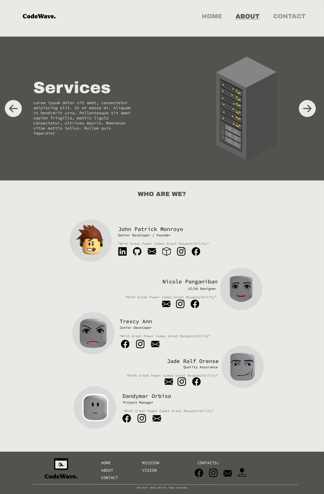
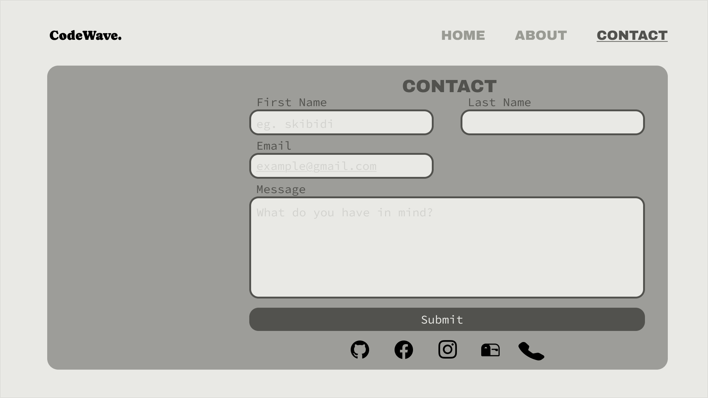

# CodeWave. 🌊


A clean and modern multi-page landing site for **CodeWave.**, a fictional web development team. This project showcases the team, their services, and provides a way for users to get in touch.

***

## 📸 Draft Design

Here's a glimpse of the CodeWave landing page.

| Home Page | About Page | Contact Page |
| :---: | :---: | :---: |
|  |  |  |

***

## ✨ Features

* **Clean & Minimalist UI:** A modern design with a professional, grayscale color palette.
* **Multi-Page Layout:** Includes distinct pages for Home, About, and Contact.
* **Team Showcase:** An "About Us" section to introduce the members of the CodeWave team.
* **Services Slider:** A simple carousel to display the services offered.
* **Functional Contact Form:** An easy-to-use form for visitors to send messages.

***

## 🛠️ Technologies Used

This project was built using core web technologies:

* **HTML5:** For the structure and content of the web pages.
* **CSS3:** For all styling, layout, and responsiveness.
* **Bootstrap:** CSS Framework.
* **JavaScript (Optional):** Can be used to power interactive elements like the services carousel and form validation.

***


## 🏁 Getting Started

To run this project locally, follow these simple steps:

1.  **Clone the repository:**
    ```sh
    git clone https://github.com/Vegapanz/CodeWave
    ```
2.  **Navigate to the project directory:**
    ```sh
    cd CodeWave
    ```
3.  **Open `index.html` in your browser:**
    * You can simply double-click the `index.html` file, or right-click and choose "Open with" your preferred browser.
